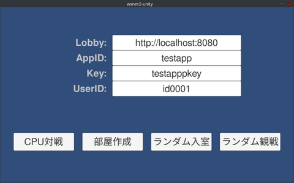
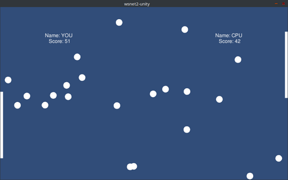

WSNet2
======

## これは何？

WSNet2はWebSocketをベースとしたモバイルオンラインゲーム向けのリアルタイム通信システムです。

### 特徴

- **WebSocketベース**: ほとんどの環境から特別な設定なく接続することができます
- **自動再接続・再送**: 利用アプリは一時的な切断を気にすることなく実装できます
- **スケーラブルな観戦**: 中継サーバ（Hub）を増やすことで大規模な観戦に対応できます
- **Unity/.Net両対応**: C#のゲームロジックをより軽量にサーバ上でも実行できます

### 動作・開発環境

- サーバ
  - Go 1.19 以降
  - MySQL 5.7 以降
- クライアント
  - C#
    - Unity 2020 以降
    - .Net 5.0 以降
  - Go 1.19 以降

## 使ってみる

### WSNet2サーバ群の起動

```shell
$ cd server
$ docker compose up
```

VMやリモート環境で起動する場合は、
`docker-compose.yml`にてgame/hubの接続ホスト名を環境変数`WSNET2_GAME_PUBLICNAME`で適切に指定してください。

### サンプルゲーム




#### Unityクライアントの使い方

`wsnet2-unity`ディレクトリをUnityで開き、`Assets/Sample/Title.unity`シーンを実行します。

- テキストボックス
  - **Lobby**: WSNet2のlobbyのURLです
  - **AppID/Key**: WSNet2に登録しているAppIDとKeyです（Dockerでは`testapp`/`testapppkey`が登録されています）
  - **UserID**: WSNet2がユーザを識別するIDです。対戦するにはお互い異なるUserIDにします
- ボタン
  - **CPU対戦**: オフラインでCPUと対戦します（WSNet2に接続しません）
  - **部屋作成**: WSNet2に部屋を作り、相手プレイヤーを待ち受けます
  - **ランダム入室**: プレイヤーを待っている部屋に入室します
  - **ランダム観戦**: 対戦中のゲームを観戦します

#### Unityクライアントでゲームロジックを動かす例

Unityクライアントのタイトルシーンで「部屋作成」ボタンを押して、部屋を作り対戦相手の入室を待ちます。
対戦相手のBotを次のように起動します。

```shell
$ cd wsnet2-dotnet/WSNet2.Sample
$ dotnet run -- -b
```
Lobbyサーバを`http://localhost:8080`以外で起動している場合は、
Titleシーン画面のLobbyに入力したうえで、Bot起動時にも`-s`オプションで指定してください。

#### サーバサイドゲームロジックで対戦する例

次のようにゲームロジッククライアント（MasterClient）とBotを起動します。
MasterClientが部屋を作り、BotとUnityクライアントの入室を待ち受けます。

```shell
$ cd wsnet2-dotnet/WSNet2.Sample
$ dotnet run -- -m -b
```

UnityクライアントのTitleシーンで「ランダム入室」を押してMasterClientの待ち受ける部屋に入室します。

#### 観戦する例

次のようにゲームロジッククライアント（MasterClient）とBotを2つ起動します。
MasterClientが部屋を作り、Botが入室して対戦を始めます。

```shell
$ cd wsnet2-dotnet/WSNet2.Sample
$ dotnet run -- -m -b 2
```

UnityクライアントのTitleシーンで「ランダム観戦」を押して観戦します。


## Documentations

### 使い方

* [C#クライアントの使い方](_doc/csharp_client.md)
* [Dockerを使ったローカルでの起動](docker.md)
* [サーバの構築](_doc/server_setup.md)

### 機能詳細

* [WSNet2のユーザ認証](_doc/user_auth.md)
* [シリアライズ可能な型](_doc/serializable.md)
* [シリアライザの使い方](_doc/serializer.md)
* [WSNet2のLogger](_doc/logger.md)

### クラス詳細

* [WSNet2Client](_doc/wsnet2client.md)
* [RoomOption](_doc/roomoption.md)
* [Room](_doc/room.md)
* [Query](_doc/query.md)
* [WSNet2Settings](_doc/wsnet2settings.md)

