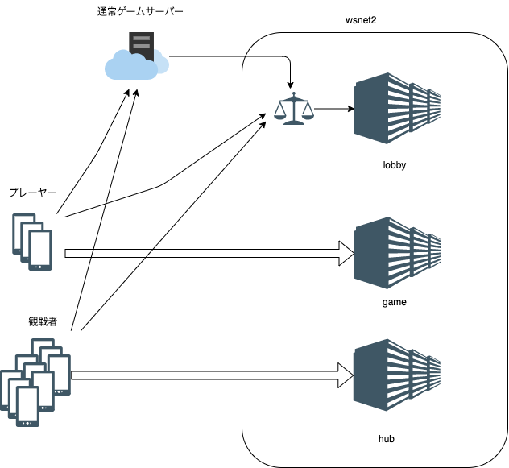

# WSNet2 Server

## 概要


WSNet2 Server は3種類のサーバーを提供します。



<dl>
<dt>Lobbyサーバー</dt>
<dd>外部からの部屋作成リクエストに応じてRoomを作成したり、参加リクエストに応じてgame/hubサーバーのRoomにプレイヤーを登録し、接続先のアドレスを案内します。またRoomの検索やランダム入室も受け付けます。</dd>
<dt>Gameサーバー</dt>
<dd>Roomを提供します。Roomに参加しGameサーバーに接続したプレーヤーは、Room内の他のプレーヤーと通信します。
<dt>Hubサーバー</dt>
<dd>Roomを観戦するためのhubを提供します。hubが仲介することで、大量の観戦者がいてもGameサーバーで行われているゲームの性能への影響を最小限に抑えます。</dd>
</dl>

## 内部構成


Lobbyサーバーは外部のプレーヤーやサーバーから、Roomの作成、検索、参加、観戦のリクエストを受けます。このAPIはHTTPベースで、メッセージ本文はmsgpackを利用しています。

内部の通信（Lobby→Game、Lobby→Hub)はgRPCを使います。

例: 部屋の作成

```mermaid
sequenceDiagram
    actor Client
    participant Lobby
    participant Game
    participant DB

    Client->>+Lobby: POST /room
    Lobby->>DB: Gameサーバー一覧取得
    Lobby->>+Game: CreateRoom (gRPC)
    Game->>DB: 部屋登録
    Game-->>-Lobby: CreateRoomRes
    Lobby-->>-Client: OK (Room info)
````
