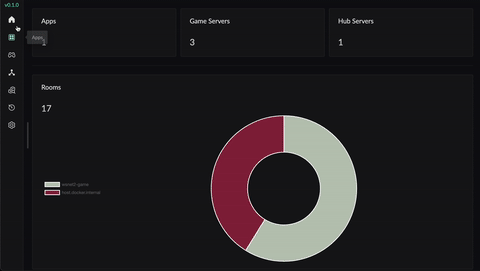

# wsnet2-dashboard

[](https://opensource.org/licenses/MIT)

[日本語](README-ja.md)



Dashboard webapp for wsnet2.

This webapp allows you to check real-time information on a running wsnet2 server. You can check servers/hubs/rooms, view detailed room information, and kick specific players in a room.

## Overview：

|                | 構成                    | リンク                        |
| -------------- | ----------------------- | ----------------------------- |
| Frontend       | Vue3 + NaiveUI          | [details](frontend/README.md) |
| Backend（BFF） | Nodejs + Prisma + Nexus | [details](backend/README.md)  |

## Deploy using docker

### You want to start wsnet2-server along with wsnet2-dashboard locally

1. Build `frontend` WEB application:
   ```bash
   cd wsnet2-dashboard
   docker compose run --rm frontbuilder
   ```
2. Start `wsnet2-server` and `wsnet2-dashboard` together:
   ```bash
   docker compose -f compose.yaml -f ../server/compose.yaml up
   ```
3. (Optional)Create a test room:
   ```bash
   docker-compose exec game /repo/server/bin/wsnet2-bot --lobby="http://lobby:8080" static 3600
   ```
4. Access `wsnet2-dashboard` through `http://localhost:8081`.

### You already have wsnet2-server running somewhere else

1. Make sure that [wsnet2-server](https://github.jp.klab.com/WSNet/wsnet2/tree/master/server) is running properly.
2. Edit environment variables in `frontend/.env` and `backend/.env` according to your setup.

   - [Environment variables for backend](backend/README.md#%E7%92%B0%E5%A2%83%E5%A4%89%E6%95%B0)
   - [Environment variables for frontend](frontend/README.md#%E7%92%B0%E5%A2%83%E5%A4%89%E6%95%B0)

3. Run `docker-compose up` to start the dashboard.
4. Access `wsnet2-dashboard` through the environment variable value ”FRONTEND_ORIGIN” .

## How to use the dashboard

You need to set the server IP uri before start using the dashboard. You will get a prompt asking you to set the uri if it is not set properly. If you have set the frontend environment variable "VITE_DEFAULT_SERVER_URI", this will be the default server IP uri that the dashboard uses.

Menu items of wsnet2-dashboard：

| Name           | Description                                                           |
| -------------- | --------------------------------------------------------------------- |
| Home           | Overview on servers/rooms                                             |
| Apps           | Apps that are using wsnet2                                            |
| Game Servers   | Game servers of wsnet2                                                |
| Hub Servers    | Hub servers of wsnet2                                                 |
| Rooms          | Search rooms of wsnet2(you can also view room data/kick players here) |
| Room Histories | Search room histories of wsnet2                                       |
| Settings       | Settings for wsnet2-dashboard                                         |

### Rooms / Room Histories

You can search specific rooms using various filters.
All filters are optional and can be combined arbitrarily.

#### Filters available for room search：

| Type                      | Description                                                               |
| ------------------------- | ------------------------------------------------------------------------- |
| Target AppIds             | AppId（allow multiple selections）                                        |
| Visible                   | Is the room visible                                                       |
| Joinable                  | Is the room joinable                                                      |
| Wachable                  | Is the room watchable                                                     |
| Host Id                   | Host id for the room(each host id corresponds to a specific game server） |
| Number                    | Number of the room                                                        |
| Max Players               | Maximum number of players allowed in the room                             |
| Search Group              | Search group of the room                                                  |
| Minimum number of players | Minimum number of players in the room                                     |
| Maximum number of players | Maximum number of players in the room                                     |
| Minimum number of wachers | Minimum number of watchers in the room                                    |
| Maximum number of wachers | Maximum number of watchers in the room                                    |
| Created (Before/After)    | Time when the room is created                                             |

#### Filters available for room history search：

| Type                   | Description                                                               |
| ---------------------- | ------------------------------------------------------------------------- |
| Target AppIds          | AppId（allow multiple selections）                                        |
| Room Id                | Id of the room                                                            |
| Host Id                | Host id for the room(each host id corresponds to a specific game server） |
| Number                 | Number of the room                                                        |
| Max Players            | Maximum number of players allowed in the room                             |
| Search Group           | Search group of the room                                                  |
| Created (Before/After) | Time when the room is created                                             |
| Closed (Before/After)  | Time when the room is closed                                              |

#### Props filter

Apply filter to custom data(props) of the room.

- Use「＋」button to add a new filter.
- value type you can use for the filter：

  | Type    | Example          |
  | ------- | ---------------- |
  | string  | "abc"            |
  | number  | "123", "1.1"     |
  | boolean | "true" / "false" |

- For props that are convoluted, you can specify using chains of the key：

  ```javascript
  (Example)
  {
      a: {
          aa: "value",
          bb: {
              aaa: "value",
              bbb: "value"
          }
      }
  }

  You can use thie to specify the value of "bbb":
  a/bb/bbb : value
  ```

#### Buttons

| Name    | Description                                      |
| ------- | ------------------------------------------------ |
| Reset   | Clear all filters                                |
| Apply   | Apply filters on cached data(no network request) |
| Refresh | Apply filters on fresh data                      |

#### Detailed view of the room

You can open the detailed view for a room by clicking the「👁‍🗨」button at the left.
Here you can see the clients and private props of the room.

- You can kick a specific player by clicking「-」at the left.
